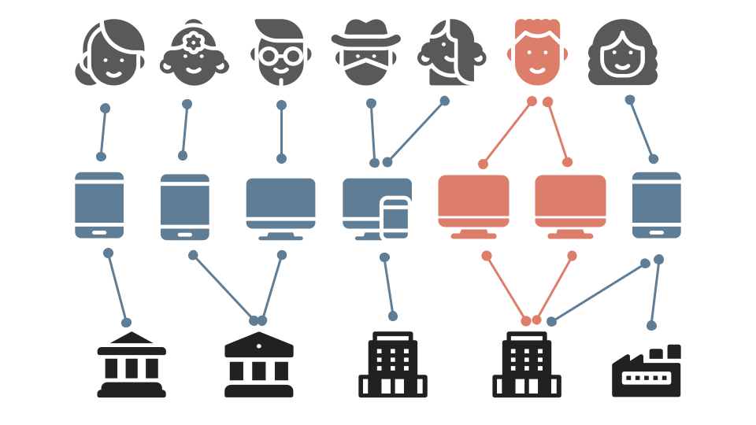

# Fraud Detection in Graph Neural Network

This repository consists of a solution that includes the analysis of financial data and detection of Fraud detection using Graph Machine Learning. The solution uses a Relational Graph Convolutional Network that generates unique graph features from neighbourhood information to aid in better and effective detection of fraud.

The setps are as follows:

1. Pre-processing
2. Making edgelists using the user identity columns
3. Generating a multi dimensional heterogenous graph using the data along with these edgelists
4. Using the Deep Learning models to generate predictions

This repo is refactored from the model used in [awslabs/sagemaker-graph-fraud-detection](https://github.com/awslabs/sagemaker-graph-fraud-detection), and implemented based on [Deep Graph Library](https://github.com/dmlc/dgl) (DGL) and PyTorch. Unlike Amazon's implementation, this repo does not require the use of Sagemaker for training. We can run it directly with the free [Google Colab](https://colab.research.google.com/) or with our own local devices.

In addition to the Fraud transaction detection problem addressed, the repo can also be used in other heterogeneous graph based scenarios, such as game account theft, online shopping fraudulent orders, etc.

## Introduction

Many online businesses lose billions of dollars to fraud each year, but machine learning-based fraud detection models can help businesses predict which interactions or users are likely to be fraudulent in order to reduce losses.

This repo formulates the problem of fraud detection as a classification task for heterogeneous interaction networks. The machine learning model used is a graphical neural network (GNN) that learns potential representations of users or transactions, which can then be easily classified as Fraud or not.

This repo constructs a heterogeneous graph of the transaction data provided in the [IEEE-CIS Fraud Detection](https://www.kaggle.com/c/ieee-fraud-detection/data) data. The following are defined as features of nodes and edges, respectively:

- **NODE:** Number of card associated, Number of address associated, Days between transactions, Match situation(name, card, address, email, etc.), Vesta engineered rich features, etc.
- **EDGE:** Purchaser and recipient email domain, Product, Card information, Address, Device information, Network connection information (IP, ISP, Proxy, etc), Digital signature (UA/browser/os/version, etc)

## Usage

If you want to run the code locally rather than on Colab, please skip the first 2 cell in each notebook.

### 1. Download dataset

The dataset used was the IEEE-CIS Fraud Detection Dataset provided by [Vesta](https://www.vesta.io/) on [Kaggle](https://www.kaggle.com/c/ieee-fraud-detection). First, we need to download the dataset from [Kaggle](https://www.kaggle.com/c/ieee-fraud-detection/data). This [link](https://www.kaggle.com/c/ieee-fraud-detection/discussion/101203) provided some additional information about the dataset.

Then put all of the CSV files into the `./ieee-data/` folder.

### 2. Data preparation

Before feeding the data to the model, we need to perform data pre-processing. Open [**10_data_loader.ipynb**](https://github.com/waittim/graph-fraud-detection/blob/main/10_data_loader.ipynb) and follow the introduction inside. The compiled data will be saved into the `./data/` folder.

### 3. Training

Open [**20_modeling.ipynb**](https://github.com/waittim/graph-fraud-detection/blob/main/20_modeling.ipynb) and follow the introduction inside. CPU training is recommended. Using GPUs may require additional environmental issues to be addressed.

### 4. After training

The trained models and related files will be save into the `./model/` folder. You can also visualize the training process by [**30_visual.ipynb**](https://github.com/waittim/graph-fraud-detection/blob/main/30_visual.ipynb). The related graphs and training record has been saved in `./output/` folder.

The architecture of the solution is as follows:

To run the code, simply run the Jupyter notebooks in this order:

1. DataPrep
2. Modelling
3. Visualization

## Results

The constructed heterogeneous graph contains a total of 726,345 Nodes and 19,518,802 Edges.

Two RGCN (Relational Graph Convolutional Networks) were developed and tested

1. Shallow RGCN
2. Deep RGCN

Despite the heavy class imbalance, the Deep RGCN produced great results and outperformed the shallow RGCN. The evaluation metric scores were as follows:

- F1: 0.6228 (Shallow network 0.48)
- Accuracy: 98% (Shallow network 97.48%)
- Precision: 0.8872 (Shallow network 0.8240)
- Recall: 0.4798 (Shallow network 0.3410)

Considering that the data is very imbalanced, we need to make a trade-off between Recall and Precision. Considering that misclassifying non-fraud transactions as fraud will seriously affect the user experience, Precision is the priority. After training, the Precision is 0.86 and the ROC is 0.92.

Confusion Matrix:
type | **Labels Positive** | **Labels Negative**
---|---|---
**Predicted Positive** | 1435 | 240
**Predicted Negative** | 2629 | 113804

## References

[Detecting fraud in heterogeneous networks using Amazon SageMaker and Deep Graph Library](https://aws.amazon.com/blogs/machine-learning/detecting-fraud-in-heterogeneous-networks-using-amazon-sagemaker-and-deep-graph-library/)
